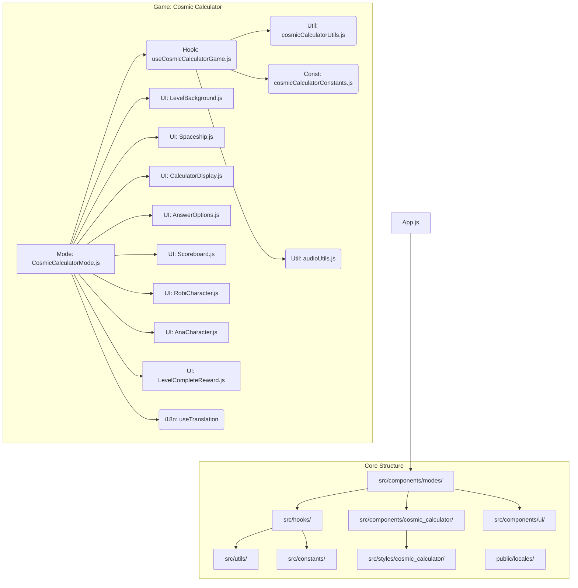

# Implementation Plan: Robi's Cosmic Calculator

This document outlines the architectural plan for implementing the "Robi's Cosmic Calculator" game within the existing project structure.

## 1. Core Architecture Pattern

The implementation will follow the established pattern observed in the "Roman Treasure" game:

*   **Game Logic Hook (`src/hooks/`):** Encapsulates state management and core game logic.
*   **Mode Component (`src/components/modes/`):** Orchestrates the game screen, uses the hook, and arranges UI components.
*   **Game-Specific UI (`src/components/[game_name]/`):** Contains unique visual elements for the game.
*   **Reusable UI (`src/components/ui/`):** Shared components (e.g., reward screens).
*   **Utilities (`src/utils/`):** Helper functions, often game-specific.
*   **Constants (`src/constants/`):** Configuration data, often game-specific.
*   **Styles (`src/styles/` or co-located):** CSS for components.
*   **Internationalization (`public/locales/`):** Text strings managed via `react-i18next`.

## 2. Component Breakdown

### 2.1. Game Logic Hook (`src/hooks/useCosmicCalculatorGame.js`)

*   **Responsibilities:** Manage game state and core logic functions.
*   **State Variables (using `useState` initially, consider `useReducer` if complexity grows):**
    *   `level` (Number, initial: 1): Current game level (1-5).
    *   `starCoins` (Number, initial: 0): Accumulated score.
    *   `currentProblem` (Object | null, initial: null): `{ id, num1, num2, correctAnswer, options }`.
    *   `problemProgress` (Object, initial: `{ current: 0, total: 0 }`): `{ current, total }` problems solved in the level.
    *   `gamePhase` (String, initial: 'loading'): Controls UI flow (e.g., 'loading', 'presenting_problem', 'animating_breakdown', 'awaiting_input', 'showing_feedback', 'level_complete', 'game_over').
    *   `animationState` (Object, initial: `{ step: null, partialSum: {}, isActive: false }`): Manages breakdown animation (`{ step: 'units'|'tens'|..., partialSum: {...}, isActive }`).
    *   `feedback` (Object | null, initial: null): Details of last answer (`{ isCorrect, messageKey, selectedOption }`).
    *   `shipUpgrades` (Object, initial: `{...defaults}`): Tracks unlocked cosmetics.
    *   `error` (String | null, initial: null): Stores any error messages.
    *   `problemHistory` (Array, initial: `[]`): Log of solved problems (optional).
*   **Core Functions:**
    *   `generateProblem(level)`: Creates a new problem using `cosmicCalculatorUtils`.
    *   `startBreakdown()`: Initiates the step-by-step animation sequence by updating `gamePhase` and `animationState`.
    *   `handleAnswer(selectedOption)`: Validates answer, updates state (`starCoins`, `problemProgress`, `feedback`), triggers effects.
    *   `nextLevel()`: Increments `level`, resets progress, handles game over.
    *   `restartGame()`: Resets state to initial values.
    *   Internal functions to manage animation steps via `setTimeout`.
*   **Dependencies:** `cosmicCalculatorUtils.js`, `cosmicCalculatorConstants.js`, `audioUtils.js`.

### 2.2. Mode Component (`src/components/modes/CosmicCalculatorMode.js`)

*   **Responsibilities:** Main container, uses the hook, renders layout and components based on `gamePhase`.
*   **Dependencies:** `useCosmicCalculatorGame`, UI components (see below), `useTranslation`.

### 2.3. Game-Specific UI Components (`src/components/cosmic_calculator/`)

*   `LevelBackground.js`: Displays level-specific space background.
*   `Spaceship.js`: Renders and animates the central spaceship.
*   `CalculatorDisplay.js`: Shows `num1`, `num2`, the animated breakdown area, and the building `partialSum`. Reacts to `animationState`.
*   `AnswerOptions.js`: Displays multiple-choice options from `currentProblem.options`.
*   `Scoreboard.js`: Shows `starCoins` and `problemProgress`.
*   `RobiCharacter.js`: Animated Robi character with messages.
*   `AnaCharacter.js`: Animated Ana character with messages.

### 2.4. Reusable UI Components (`src/components/ui/`)

*   `LevelCompleteReward.js`: Modal/screen for level completion (adapt `TreasureReward.js` if suitable).

### 2.5. Utilities (`src/utils/cosmicCalculatorUtils.js`)

*   **`generateNoCarryAdditionProblem(level, levelConfig)`:**
    *   Generates `num1` randomly based on `levelConfig.numDigits`.
    *   Generates `num2` digit by digit, ensuring `digit1 + digit2 <= 9` for each place value.
    *   Calculates `correctAnswer = num1 + num2`.
    *   Generates plausible incorrect `options`.
    *   Returns `{ id, num1, num2, correctAnswer, options }`.
*   Helper functions for number manipulation (e.g., getting digits).

### 2.6. Constants (`src/constants/cosmicCalculatorConstants.js`)

*   `LEVEL_CONFIG`: Array/object defining level parameters (digits, problems per level, zone name, number range).
*   `CHARACTER_MESSAGES`: Dialogue keys for Robi/Ana for different events.
*   `SHIP_UPGRADES`: Definitions of upgrades.

### 2.7. Styles (`src/styles/cosmic_calculator/`)

*   CSS modules or stylesheets for new components, including animations.

### 2.8. Internationalization (`public/locales/[lang]/translation.json`)

*   Add new keys and translations for all user-facing text.

## 3. Implementation Steps Overview

1.  Create constant definitions (`cosmicCalculatorConstants.js`).
2.  Implement utility functions (`cosmicCalculatorUtils.js`), especially `generateNoCarryAdditionProblem`.
3.  Develop the game logic hook (`useCosmicCalculatorGame.js`) with state and core functions.
4.  Build the individual UI components (`src/components/cosmic_calculator/`).
5.  Assemble the components and logic in the mode component (`CosmicCalculatorMode.js`).
6.  Add styles and animations (`src/styles/cosmic_calculator/`).
7.  Add translations (`public/locales/`).
8.  Integrate the new mode into the application's navigation/routing (likely `App.js`).
9.  Test thoroughly across levels and scenarios.

## 4. Diagrams

### Architecture Overview



### Game Phase Flow (Simplified)

```mermaid
graph TD
    A[Start/Loading] --> B{Generate Problem};
    B --> C[Present Problem];
    C --> D{Start Breakdown Animation};
    D -- Animation Steps --> E[Show Partial Sums];
    E -- Animation Done --> F[Await Player Input];
    F -- Player Selects Option --> G{Handle Answer};
    G -- Correct & Level Not Complete --> B;
    G -- Incorrect --> H[Show Feedback];
    H --> B;
    G -- Correct & Level Complete --> I{Level Complete};
    I --> J[Show Reward Screen];
    J -- Player Continues & More Levels --> K{Next Level};
    K --> B;
    J -- Player Continues & No More Levels --> L[Game Over];